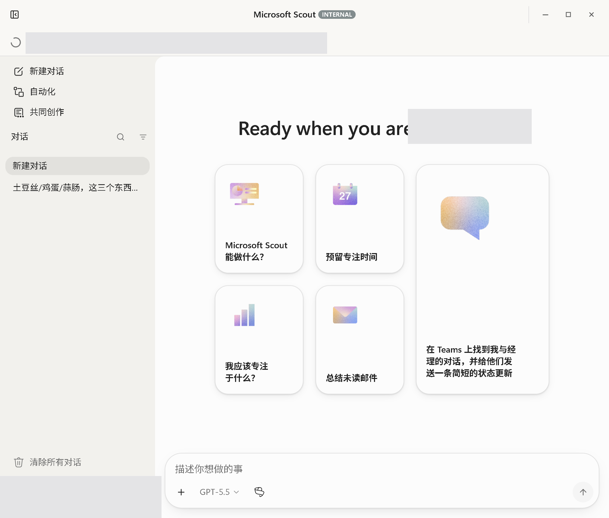
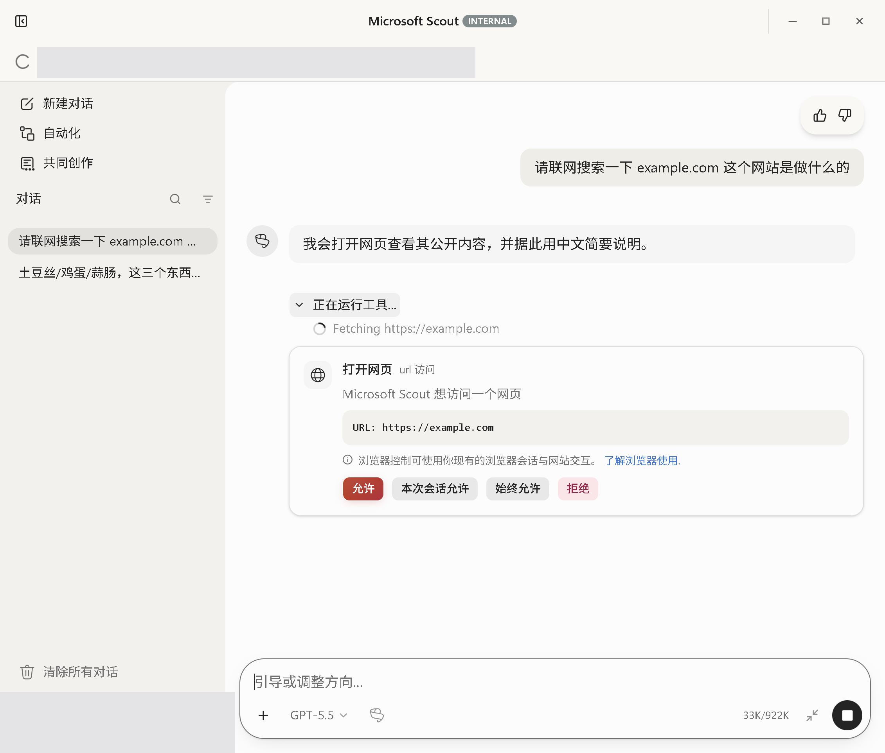
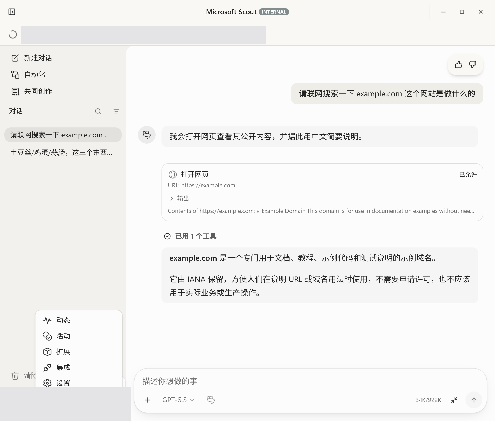
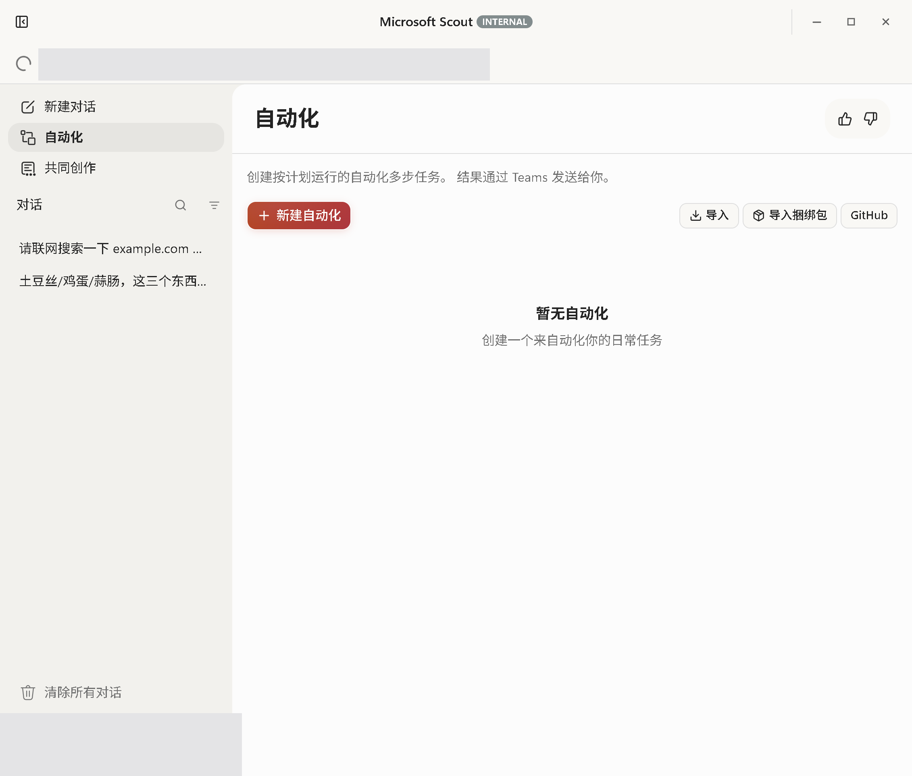
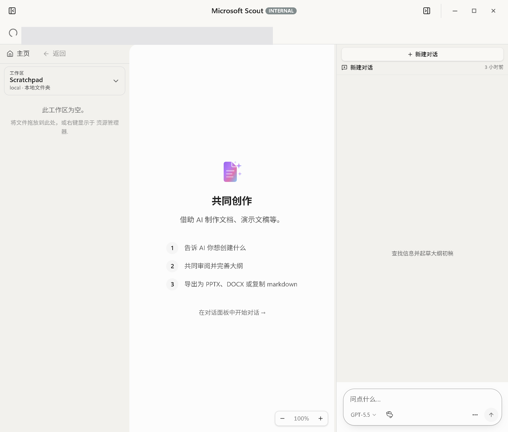
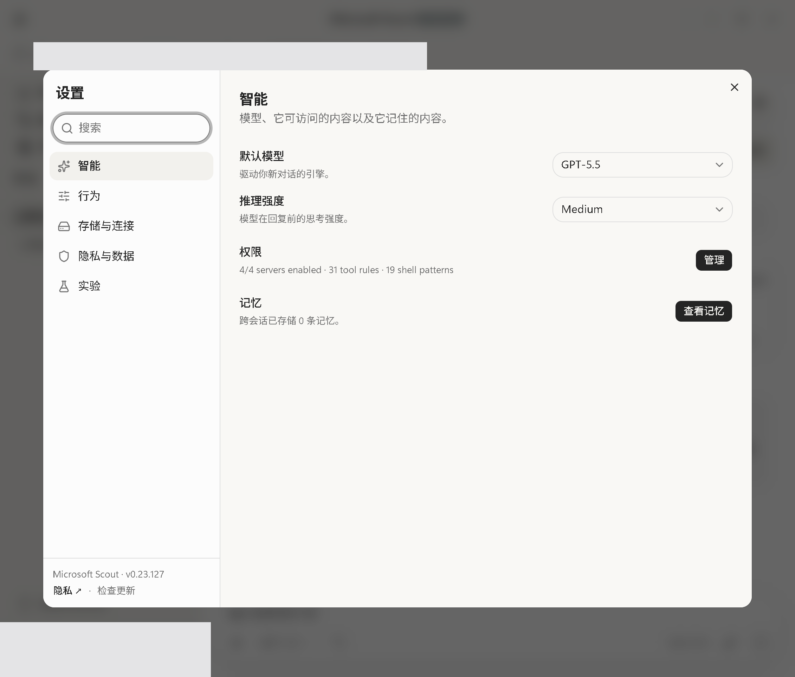
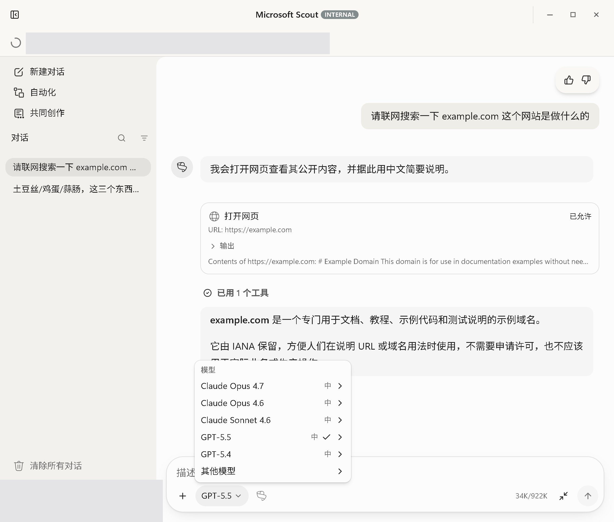

# ScoutLauncher · Microsoft Scout 中文汉化加载器


Microsoft Scout 是微软在 Build 2026 开发者大会期间推出的一款 AI 代理，定位为全天候
AI 个人助理，深度整合 Microsoft 365 生态中的 Outlook、OneDrive、Teams 等应用，是
微软首款定位为个人助理的 AI 代理。

这是针对Scout没有中文，且没有I18n设计的一种外挂式处理翻译

---

## 🚀 快速开始

1. 装好并登录 Microsoft Scout（0.22.x 及以上）【注意你必须自行安装主程序并且获取到使用权限】。
2. 下载本仓库 release版本并安装
3. 运行程序，它会自动接管正在运行的 Scout 并把界面变成中文，然后缩到
   右下角托盘常驻。
   - **再次双击** = 展开/收起运行日志窗口；
   - 托盘图标**右键** → 「退出并关闭汉化」= 变回原版英文（不影响 Scout）；
   - 托盘图标右键 → 「项目主页」= 打开本仓库。


---

## 安全

 - 不触碰Scout代码本身
 - 中文加载器
 - 可以自行检查代码

---

## 都翻了哪些地方

日常能看到的地方基本都是中文了，挨个放几张图 👇

**主界面和左边导航**——新建对话、自动化、共同创作、输入框这些。


**要授权的时候**——它要联网或者开网页，会先问你一句，「允许 / 本次会话允许 /
始终允许 / 拒绝」都写得清清楚楚。


**干活的过程**——Scout 正在做什么，「打开网页 / 已允许 / 输出」这些都能看明白。


**自动化**——那种定时自动跑的任务，整页都翻了。


**共同创作**——跟 AI 一起写文档、做 PPT 的地方，每一步说明都是中文。


**设置**——各项配置的标题和说明都翻好了，一看就知道是干嘛的。


**选模型**——切换的菜单翻了；模型名字（GPT-5.5、Claude 这些）留着英文，看着反而更顺。


---

## 目录结构

```
ScoutLauncher/
├─ README.md              你正在看的这份
├─ assets/                截图
├─ lang/                  语言包（想加新语言照着复制一份即可）
│  └─ dictionary.zh-CN.json
├─ installer/             安装包定义（WiX 脚本 + 许可页）
└─ src/                   加载器源码（想自己编译看这里）
   ├─ ScoutZh.cs          主程序（C#，.NET Framework）
   ├─ overlay-engine.js   语言无关的翻译引擎（编译时嵌入 exe）
   ├─ scout.ico           图标
   └─ build-exe.ps1       一键编译脚本
```

---

## 自己编译

只要 Win10/11（自带 .NET Framework 4.6+），不用装任何 SDK：

```powershell
cd src
powershell -ExecutionPolicy Bypass -File build-exe.ps1
```

会在 `src/` 下生成 `Scout Loader.exe`。运行时记得把 `dictionary.zh-CN.json`
（在 `lang/`）放到 exe 同目录。

想做别的语言：复制一份 `dictionary.zh-CN.json` 改成 `dictionary.<语言标签>.json`
（如 `dictionary.ja-JP.json`），翻译里面的值，然后 `Scout Loader.exe --lang ja-JP`
即可，**exe 不用重新编译**。

---

## 发布新版本（自动出 MSI）

发布走 CI/CD：**推一个版本 tag，GitHub Actions 自动编译并生成 MSI 安装包**，
挂到对应版本号的 Release 上。MSI 里打包了两个产物——`Scout Loader.exe` 和
`dictionary.zh-CN.json`，装好即用（含开始菜单快捷方式，卸载干净）。

```bash
git tag v1.2.0
git push origin v1.2.0
```

- 版本号从 tag 解析（去掉前缀 `v`，格式须为 `x.y.z`），并写进程序集版本。
- 流水线定义见 [.github/workflows/release.yml](.github/workflows/release.yml)，
  安装包定义见 [installer/ScoutLauncher.wxs](installer/ScoutLauncher.wxs)。

---

## 翻得不对的地方，欢迎说

先声明：这些词基本都是 **Opus** 翻的，所以哪句读着别扭、不准，或者还有没翻到的，
锅归它 —— 提个 [issue](https://github.com/kukisama/ScoutLauncher/issues) 骂它就行，
反正修也是它修。😌

我就是个负责点鼠标、跑跑程序的工具人，纯属打杂。谢谢大家 🙏
